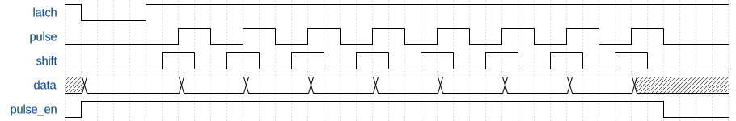

# ASIC FPGA Prototyping - Custom Game Controller

## Overview
In this lab, we will put together some of the building blocks we have learned to create our very own game controller! We will use the same principles that the NES, SNES, and Virtual Boy used to communicate with their controllers. 

## Required materials
For this lab the following materials will be needed:

- Breadboard (Large one will do but a small one is ideal)
- Buttons (any size/type will work)
- 10k Resistors
- 5 Jumper cables with at least one female end (Can be obtained from the ECE shop)
- 74HC165 or comparable parallel-to-serial shift register (Can be obtained from the ECE shop)

## Setup
To begin, open a terminal window, create a new directory, and move into it. Also, setup the directory structure and copy over the base makefile.

```bash
mkdir custom-game-controller
cd custom-game-controller
mkdir source
cp $TOOLSDIR/makefile .
```

This will be the standard setup for most labs.

Also, copy over your `flex_counter` and `flex_stp_sr` modules from previous labs.

## Basic Game Controller
The principles learned so far in these labs can be used to talk to old game controllers, or even a custom game controller that we can make ourselves! In this lab, we'll make a custom game controller and use our Serial-to-Parallel Shift Register implementation to talk to it! The concepts of this section are exactly how NES, SNES, and Virtual Boy Controllers work, and it's super simple! I'll be referring to the SNES the most since I have a reproduction controller on hand, but all three controllers/consoles work the same way and are actually compatible[^1].

[^1]: Well, almost. The NES controller has 8 buttons while the SNES controller has 12. This means that you can only use the first 8 buttons of the SNES controller if hooked up to a NES. Likewise, hooking an NES controller up to an SNES means you'll be missing some buttons. Also, they each use different connectors (although they contain the same signals).

### How the SNES Controller works
As alluded to above, the SNES controller is essentially just a 16-bit Parallel-to-Serial IC that has it's signals controlled by the console. The console "polls" the controller at a rate of 60 Hz. The console "polls" the controller by doing the following:

1. Send a 12µs wide latch pulse. 
    - On the SNES, this is a positive pulse.
    - This puts the state of the buttons into the shift register
1. 6µs after the falling edge of the latch pulse, 16 clock pulses are sent.
    - The period of these pulses is 12µs
    - They have a 50% duty cycle
1. On the falling edge of each clock pulse, the data line is recorded.
1. This is mapped back to the buttons, and is used by the system for input.

A couple things to note:

- The buttons on the SNES controller are active low.
- Since the SNES controller only has 12 buttons, the last 4 pulses are always high

I disassembled my reproduction SNES controller, with the intention of determining the chip that converts the button inputs to a serial stream, but the chip is unfortunately covered, so you can't see it. Luckily the internet has plenty of pictures of real SNES controllers such as this one from ifixit:


As you can see, it uses the 520B IC. Unfortunately, I was unable to find a datasheet for that specific chip anywhere online, but plenty of people vouch that it's a 16-bit parallel-to-serial shift register. Given the protocol that this controller uses and the traces on the controller's PCB, we can see that this makes sense.

### What is the 74HC165 and what do we need it for?
The [SN74HC165](https://www.ti.com/lit/ds/symlink/sn74hc165.pdf?ts=1644199293784&ref_url=https%253A%252F%252Fwww.ti.com%252Fproduct%252FSN74HC165) is an 8-bit Parallel-to-Serial (PtS) Shift Register. 

It works by allowing the `SH/~LD` pin to determine the current operation of the chip. When `SH/~LD` is high, the values in the shift register are shifted out. It's important to note that the shifted value out starts from pin 'H' not 'A'. The value on `SER` determines what value gets shifted in. For this lab, we'll pull it low. When the `SH/~LD` line goes low, the values currently asserted on lines A-H are loaded into the shift register. 

The following table describes the connections to the 74HC165.

| signal | pin name |
| ------ | -------- |
| latch  | `SH/~LD` |
| pulse  | `CLK` |
| data   | `~QH` |
| +3.3v  | `VCC` |
| GND    | `GND` |

You should take a look at the data sheet (linked above) for this IC, since we will need to understand how it works to talk to it. Think about the difference between the signals used for the SNES controller and the signals we'll use for our controller.

A couple of differences between the SNES controller and our custom controller are listed below:

- On the SNES, the latch pulse is high. Since our IC will shift when the latch signal is high and load when the signal is low, our latch pulse needs to be a negative pulse.
- We will wire our controller to have active high buttons.
    - However, we will use the inverted output on the '165, so the buttons will appear to be active low
    - This is also because the inverted output is on the same side of the IC as the other signals we need. This will make wiring neater.
- The '165 only has 8 inputs. Therefore, we'll only send 8 clock pulses to our controller.

### Tips for building your controller
It's now time to build your custom controller! You are free to build your controller however you like, but here are some requirements/tips:

- You can have a maximum of 8 buttons (unless you daisy-chain '165 chips)
- You should have a minimum of 6 buttons
- The buttons should be wired active high (as mentioned above)
- Each button should have a pull down resistor on the signal side
- All unused inputs on the shift register should be pulled low
- The `SER` and `CLK INH` pins must be pulled low
- Don't forget to connect your power rails together
- Neat wiring is critical for debugging and mapping

### Button mapping
If it isn't clear already, we'll be using our Serial-to-Parallel shift register implementation to keep track of the buttons being pressed. We'll poll the controller and take in the data one bit at a time. To do this, you'll need to know which buttons are mapped to which input of the '165 shift register. You should create a picture with your buttons labeled and a table that matches these labels to the bit of the StP shift register. My custom controller is shown as an example below:


| Bit # | Button Mapping |
| ---- | ---- |
| 0 | low (unused) |
| 1 | L |
| 2 | D |
| 3 | R |
| 4 | low (unused) |
| 5 | U |
| 6 | B |
| 7 | A |

## Putting it all together
In the final part of this lab we will be using our shift register and counter implementations  to communicate with our custom game controller. We won't be using the controller to do anything too crazy, just light up the LEDs for now, but we will use the controller in later labs to do some cool things! You should try experimenting with the development board and controller to do something cool.

### Physical Connections
We have 5 total wires that will connect between our controller and the development board. One wire is power, one wire is ground, the remaining three wires are the signals: clk (pulse), latch, and data. We'll connect these wires to GPIO pins on the development board. Connect latch to GPIO[0], clk/pulse to GPIO[1], and data to GPIO[2]. On the expansion header, pins 29 and 30 are +3.3v and GND respectively. Connect them to your controller as well. Be sure to check the polarity before plugging it into your controller!

### `custom_controller` module
To start, create a new module `custom_controller` with the following parameters. Keep the signal names general for now, as we'll create a wrapper to map this to our actual controller later. This will allow us to specify multiple controllers in the future.

| Name | Direction | Width | Description |
| ---- | ---- | ---- | ---- |
| clk | input | 1 bit | clock signal. Assume it's a 50 MHz clock |
| n_rst | input | 1 bit | reset signal |
| data | input | 1 bit | input data signal |
| latch | output | 1 bit | generated latch signal |
| pulse | output | 1 bit | generated pulse signal |
| buttons | output | 8 bits | the current states of the buttons |

#### Signals



It is important to note that the `latch`, `pulse`, and `data` signals are the only ones visible to the controller. The `shift` and `pulse_en` signals are internal to the implementation and are shown to help with your implementation. The signals are all described in more detail below.

- The `latch` signal is a negative pulse that is 12µs wide and has a frequency of 60Hz
- The `pulse` signal will control the shift register on the controller itself. It has a period of 12µs
- The `shift` signal will control the StP shift register, and occurs 3µs before the `pulse` signal
    - This is so that we can get the data bit in a stable state
    - We can't just use the negative edge of `pulse` because the first bit is asserted on load
- The `data` signal comes from the controller and is high for not pressed, low for pressed
- The `pulse_en` signal enables the `pulse` and `shift` signals

#### Additional Specifications

- Assume the input `clk` is 50 MHz
- `buttons` should not update until after all 8 data pulses have been received
    - I.E. We should not see the shifting as the buttons come in

### `mapped_controller` module
This module should be pretty straightforward, and will connect the GPIO pins on the dev board to your `custom_controller` implementation.

| name | direction | description |
| ---- | ---- | ---- |
| CLOCK_50 | input | a 50 MHz input clock from the development board |
| [0:0] KEY | input | KEY[0] will act as the reset button |
| [7:0] LEDG | output | the green LEDs will show the button states |
| [2:0] GPIO | inout | GPIO will be declared as inout since some signals are inputs and some are outputs |

### How to Implement the `custom_controller` and `mapped_controller` Modules
To begin, create the `mapped_controller` module and connect the signals appropriately. This way, you are able to test your generated signals as you go along.

#### Create the 60Hz `latch` Signal
The first challenge is to create a 60Hz `latch` signal that follows the provided specifications. Once completed, connect GPIO[0] to an oscilloscope and confirm the signal acts as intended.

**Question:** How many 50MHz clock cycles are in 1 60Hz cycle?

A proper `latch` signal can be seen in the images below.


The latch signal up close. You can see it is exactly 12µs wide.


Multiple latch signals. You can see that they are occurring at a frequency of 60Hz

#### Create the `pulse` Signal
Now that you have a proper `latch` signal, create the `pulse` signal, which should start right after the `latch` signal goes low.

**Question:** How can we use our existing signal to align the `pulse` signal with the `latch` signal? How can we stop the `pulse` signal after 8 pulses?

Proper `latch` and `pulse` signals can be seen together below.


#### Create the `shift` Signal
This signal should be identical to the `pulse` signal, but shifted forward by 3µs. For testing, output it on GPIO[2] and compare it to the `pulse` signal. The two signals together can be seen in the image below.


#### Buffer the `buttons` Output
Remember that we want to update the `buttons` output only after all the buttons have been received. Otherwise, out `buttons` output would constantly be changing and it would be impossible to determine which buttons are being pressed. To ensure no issues, chose a point sometime after the pulses have stopped to load output of the StP shift register into `buttons`.

You'll know if this is working if your LEDs are either completely on or completely off (I.E. not dimmed when the corresponding button is pressed)

### Test it out!
At this point, your controller interface should be complete. Try testing it out and seeing your button presses turn off the corresponding LEDs!

### Advice
Don't overcomplicate things! This can seem like a monumental task unless you break it into small pieces