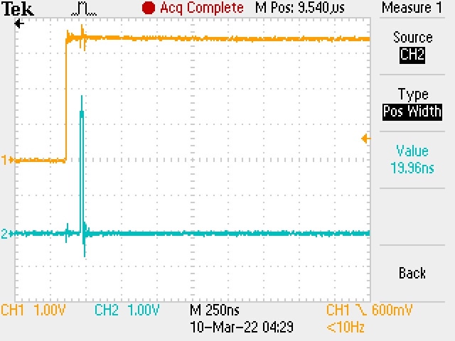
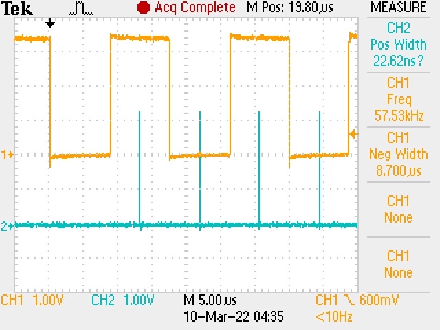

# ASIC FPGA Prototyping - UART Receiver

## Overview
In this lab, we will be using the UART receiver designed in ECE 337 and the 7-segment displays to interact with a terminal.

## Required Materials
It will be necessary to have a USB to RS-232 cable to connect your computer to the DE2-115 development board.

I recommend [this one for \$9 on amazon](https://www.amazon.com/gp/product/B0753HBT12/ref=ppx_yo_dt_b_asin_title_o00_s00?ie=UTF8&psc=1)

## Setup
To begin, open a terminal window, create a new directory, and move into it. Also, setup the directory structure and copy over the base makefile.

```bash
mkdir uart-receiver
cd uart-receiver
mkdir source
cp $TOOLSDIR/makefile .
```

In addition to the above setup, copy over all the files from your UART implementation.

## Alphanumeric 7-Segment Display Module
First, create a new 7-segment display module called `alpha_display` that will display alphanumeric characters on our 7-segment display.

`alpha_display.sv`:

| name | direction | width | description |
| ---- | ---- | ---- | ---- |
| ascii | input | 8 bits | the 8-bit ascii value to interpret |
| disp | output | 7 bits | the 7-segment display to output on |

Since 7 segment displays have 7 segments which can be on or off, we can theoretically display all 128 characters defined by the original ASCII standard (2^7 = 128). However, many of these characters are unrecognizable (think x, m, and w) and thus wouldn't make much practical sense to implement.

Instead, we'll implement the characters that display nicely, and have a catch-all case to display nothing for all the other characters.

Your design should meet the following requirements:

- Be purely combinational (no clock, no reset)
- Must implement characters 0-9 and A-Z except K, M, V, W, X, Z
- Both the upper and lowercase versions of each character should map to the same result
    - I.E 'B' and 'b' should both map to lowercase 'b' on the display
    - Try to distinguish between letters and numbers (0 and o)
- Add any additional characters you would like

Some resources on 7-segment display characters and ASCII codes:

 - [wikichip](https://en.wikichip.org/wiki/seven-segment_display/representing_letters)
 - [pfnicholls](http://pfnicholls.com/Electronics/LEDDisplays.html)

Once completed, be sure to test your design by writing "hello" on the 7 segment displays.

## Modifications to the UART module
As it currently stands, our UART module requires a baud rate of 400Mb/s. For reference, the highest standardized baud rate is under 1Mb/s. Additionally, we will be using the DE2's 50MHz clock instead of a 400MHz clock. This gives us a new baud rate of 5Mbps, although we want to use something more standard.

You should modify your UART design to have a baud rate of 115200. 

#### **Question:** What do you need to divide the clock by to get a baud rate of 115200?

## Setting up RS-232 communications

At this point in the lab it is necessary to setup RS-232 communications so that we can utilize the USB to UART cable. Follow the instructions in the video to get your cable working with your computer. 

[https://www.youtube.com/watch?v=YNfvNvqnYgM](https://www.youtube.com/watch?v=YNfvNvqnYgM)

## Receiving a single character

Now that our UART module can receive at a standard rate and our USB to UART connection is setup, you should create a module called `single_char_receive` that connects the UART instance with an alphanumeric display.

You should use the following peripherals on the board:

- 50 MHz Clock
- One Key (button) for active low reset
- All four UART signals
    - Pull CTS low
    - Pull TXD high
- 2 red LEDs to indicate framing and overrun errors
- One 7-segment display

Once you've created your module, try sending characters to it!

You'll notice that you occasionally get framing errors (actually, quite often). This is because the two clock cycle wait state is not adequate enough for our use. We're measuring as the signals are still settling, whereas we should be aiming to measure in the middle of our bit.

What we currently have:

| The signal sampled after a 2-clock wait state |
| ---- |
|  |

| Zoomed in version of early sampling |
| ---- |
|  |

What we want:

| The signal sampled in the middle of the bit |
| ---- |
| 

Further modify your UART design to use a timer in the wait state so that the signal samples occur in the middle of the bit.


## Receiving multiple characters
Now that you've fixed the framing errors and have a single character receive system working. Expand your implementation to keep multiple characters by chaining the 7-segment displays together. Try spelling out words and phrases. Place this implementation in a module named `multi_char_receive`.

## How to debug when things don't work
The best and really only efficient way to debug issues with your UART signals are to route them to GPIO pins and view them on an oscilloscope. This will allow you to see where your signal is being measured, the UART signal coming from the terminal, and your clock signals that control your UART implementation. It's very similar to viewing the simulated waves, except these waves are real!