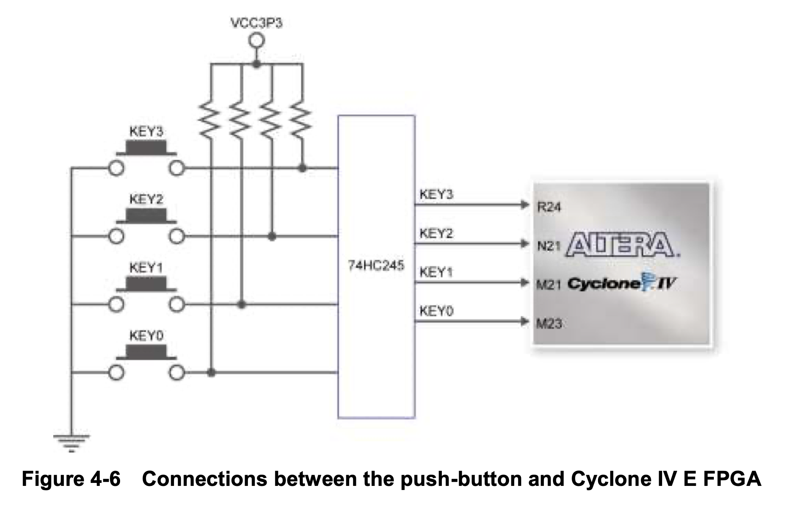
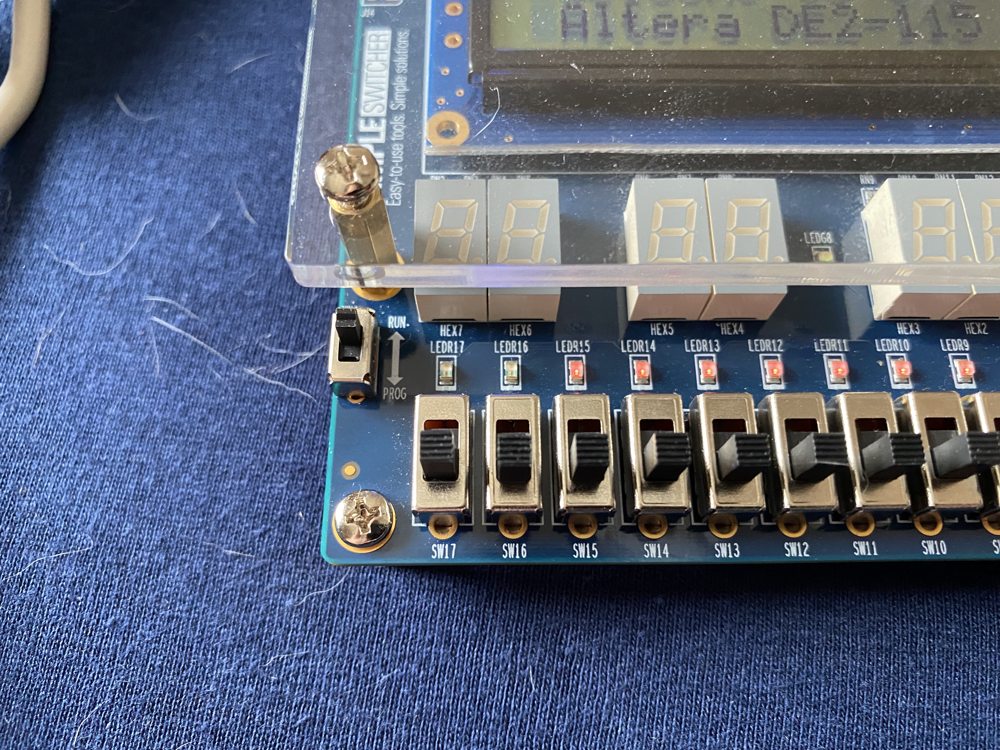
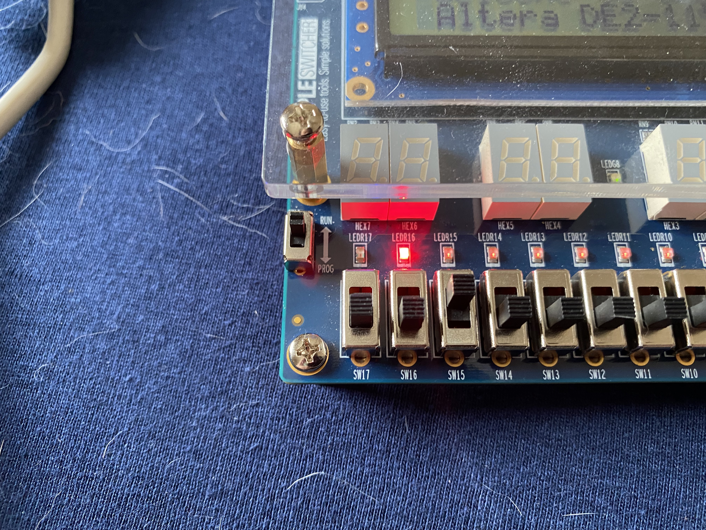
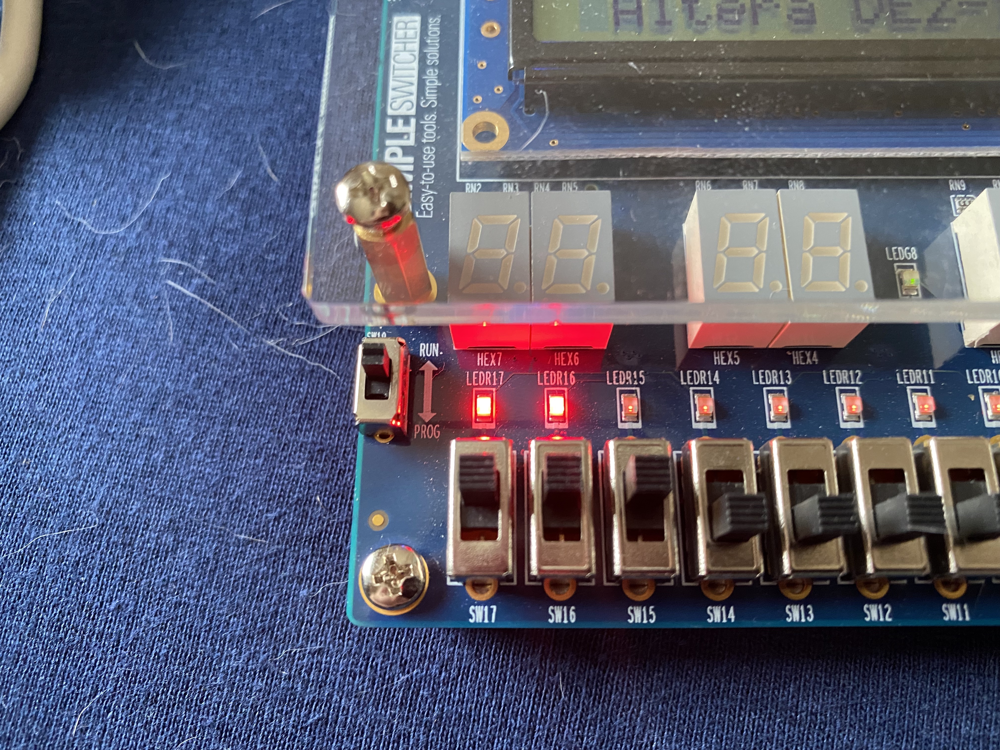
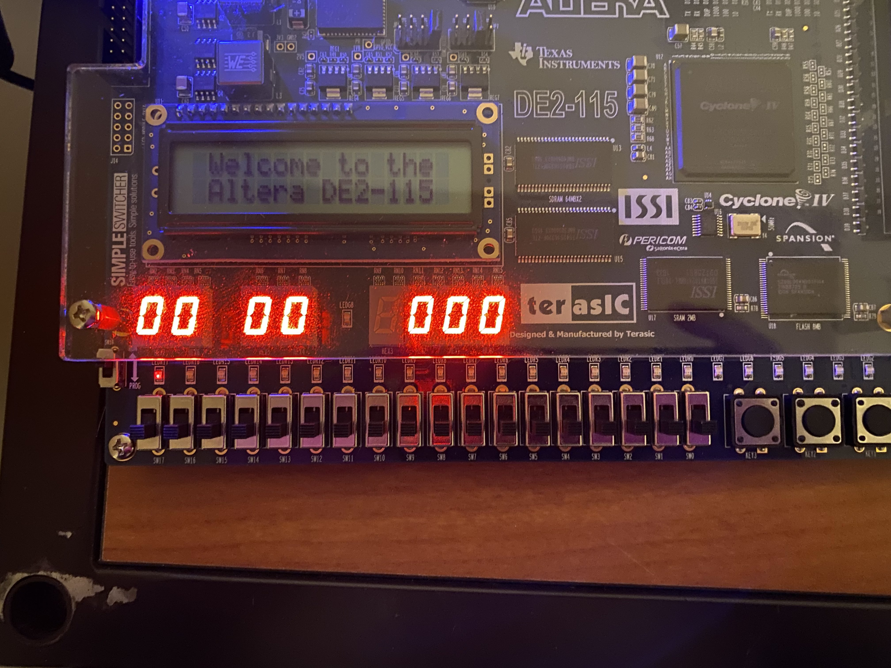
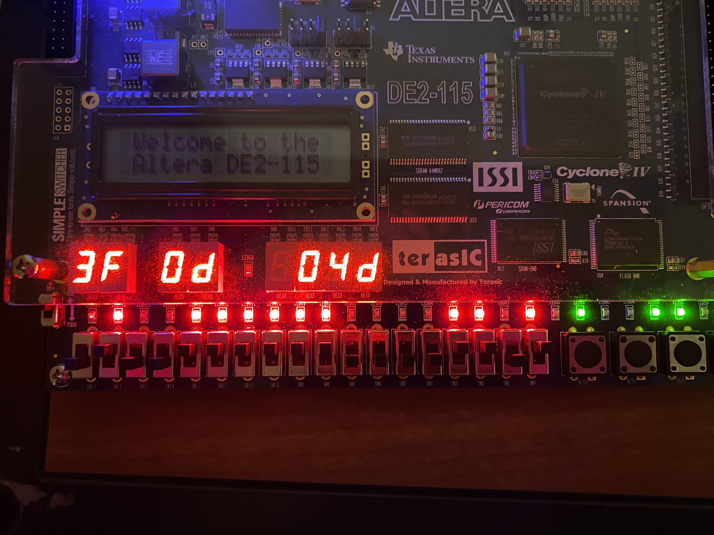
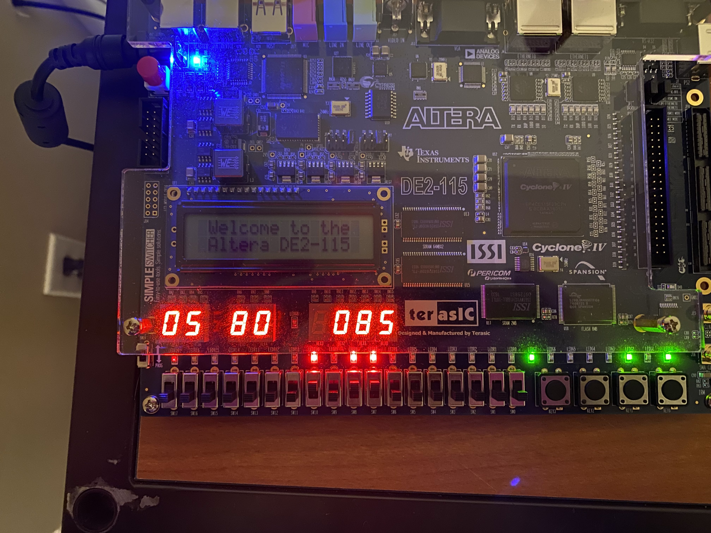
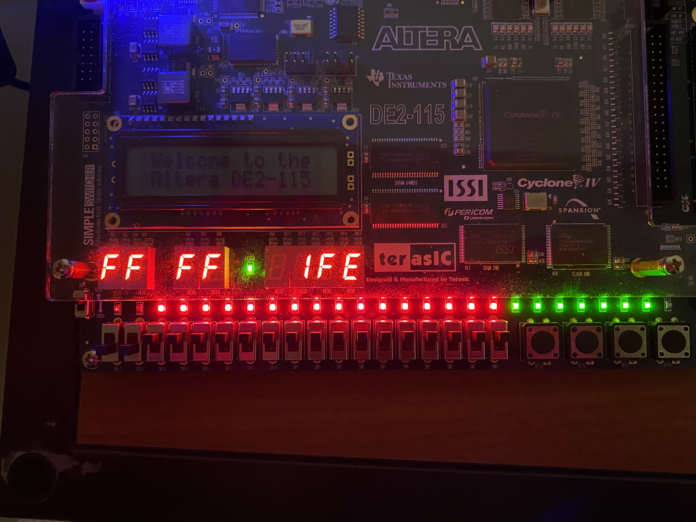

# ASIC FPGA Prototyping - Adder/Error Detector Solution

## Overview
This document contains my (Jared's) solutions to the Adder/Error Detector lab.

## Sensor error detector
My code solution to the sensor error detector is located in the `adder-error-detector` folder on GitHub. It contains the code to show the error on the green LED between the 7-segment displays, and uses switches 3:0 as sensor inputs. Below are some pictures of my solution running on the board.

![Running on LEDG[8]. Currently no errors.](./img/sed-switch-green-off.jpg)
No error condition met. The switches are currently all off and LEDG8 is off.

![Running on LEDG[8]. Error condition met.](./img/sed-switch-green-on.jpg)
An error condition is now met since the high priority error is tripped. LEDG8 is on.

### Challenge 1
The code for this section is not in the repository, but simply replace `input logic [3:0]SW,` with `input logic [3:0]KEY,` and replace the references to `SW[x]` with `KEY[x]` and the program will use the push buttons instead of the switches.


The keys (push buttons) are now being used as input. All sensors are showing errors, so LEDG8 is on.


Now that some of the keys aren't showing errors, the error condition is not met and LEDG8 is off.

#### Question: Why does the error detector appear to have "flipped" behavior when using the buttons?
The buttons are active low! So the sensors are always "tripped" unless the buttons are being pushed.

From the DE2-115 Documentation, Chapter 4.2:
>The DE2-115 board provides four push-button switches as shown in Figure 4-6. Each of these switches is debounced using a Schmitt Trigger circuit, as indicated in Figure 4-7. The four outputs called KEY0, KEY1, KEY2, and KEY3 of the Schmitt Trigger devices are connected directly to the Cyclone IV E FPGA. <mark>Each push-button switch provides a high logic level when it is not pressed, and provides a low logic level when depressed</mark>. Since the push-button switches are debounced, they are appropriate for using as clock or reset inputs in a circuit.

Also, Figure 4-6:


### Challenge 2
The code for this section is not on the repository either, but simply replace `output logic [8:8]LEDG` with `output logic [0:0]LEDR` or `output logic [8:8]LEDR` and replace the reference to `LEDG` and the code will use the appropriate red LED.

![Running on LEDR[8]](./img/sed-red-8.jpg)
Now LEDR8 is showing the error condition.

![Running on LEDR[0]](./img/sed-red-0.jpg)
LEDR0 is showing the error condition.

#### Question: What happens if you initialize more than one red LED by saying `output logic [8:0]LEDR`?
Only the LED referenced to display the error will light up. The others will be off by default and will never turn on.

#### Question: What happens to all the LEDs that are initialized? What about the uninitialized ones?
All uninitialized LEDs will be dimmed. All initialized LEDs will be low be default, but if they are connected to logic they will take the value assigned to them.

## 1-bit adder

The code for my implementation can be seen in the `adder-error-detector` folder on GitHub. Below are some pictures of my solution running.


Inputs ci:0, a:0, b:0 Outputs co:0, sum:0


Inputs ci:0, a:0, b:1 Outputs co:0, sum:1


Inputs ci:0, a:1, b:1 Outputs co:1, sum:0


Inputs ci:1, a:1, b:1 Outputs co:1, sum:1

#### Question: Did you use 3 input statements and 2 output statement? If you're using sequential Switches/LEDs, do you need 3/2 statements respectively? How can you condense these into one statement each?
You can turn this...

```verilog
    input logic [17:17]SW,
    input logic [16:16]SW,
    input logic [15:15]SW,
    output logic [17:17]LEDR,
    output logic [16:16]LEDR
```

...into this...

```verilog
    input logic [17:15]SW,
    output logic [17:16] LEDR
```

## 8-bit adder
My solution for this section can be found in the `adder-error-detector` folder on GitHub. Below are some images of my final implementation in action. I used a 2D array to act as a multiplexer, taking in the input from the switches and sum and outputting the appropriate 7-segment value to display. I'm quite happy with this implementation.


Inputs ci:0 a:0x00, b:0x00, Outputs co:0, sum:0x00


Inputs ci:1, a:0x3f, b:0x0d, Outputs co:0, sum:0x4d


Inputs ci:0, a:0x05, b:0x80, Outputs co:0, sum:0x85


Inputs ci:0, a:0xff, b:0xff, Outputs co:1, sum:0xfe