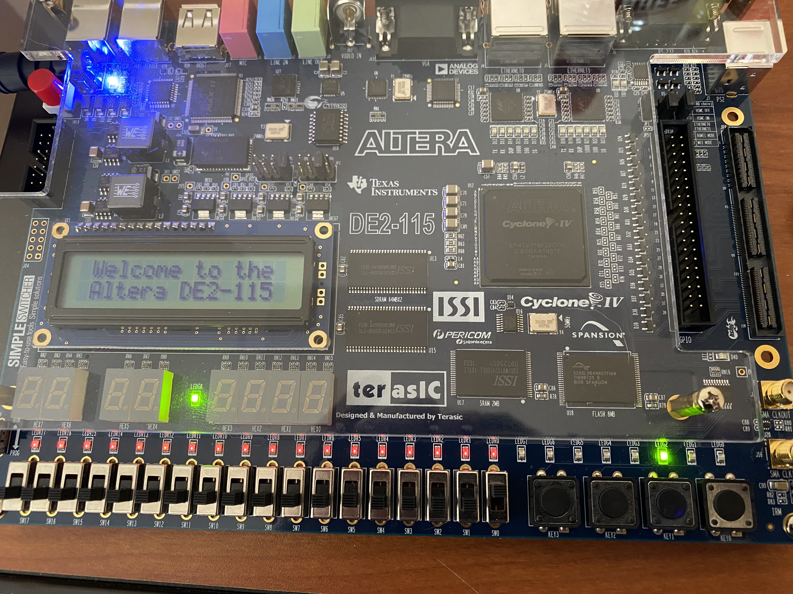
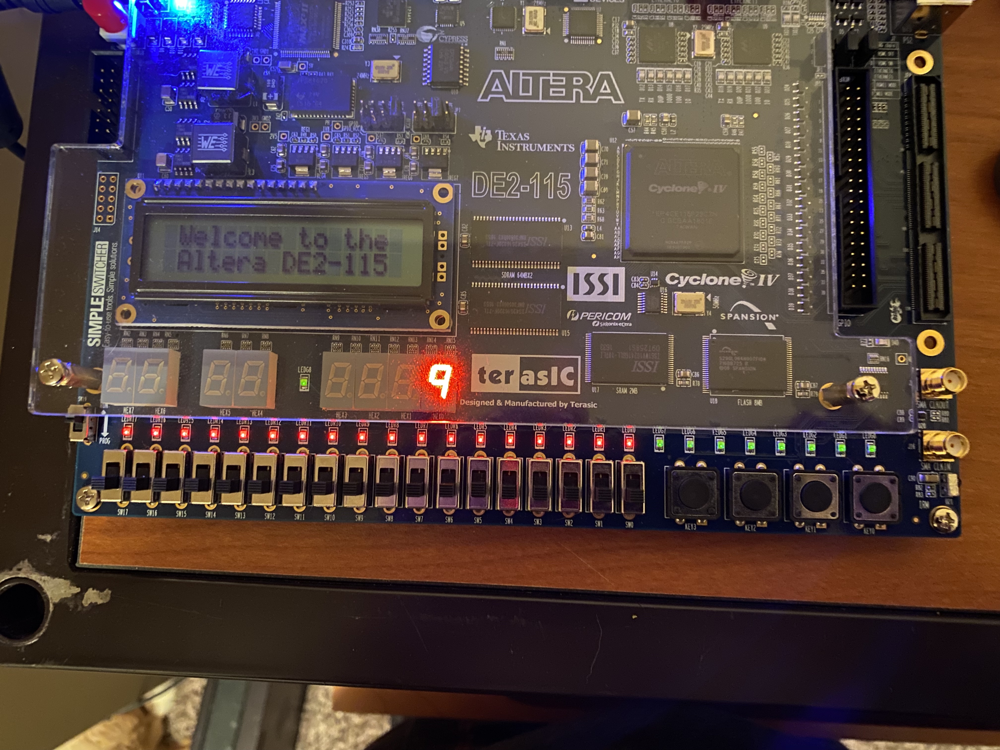
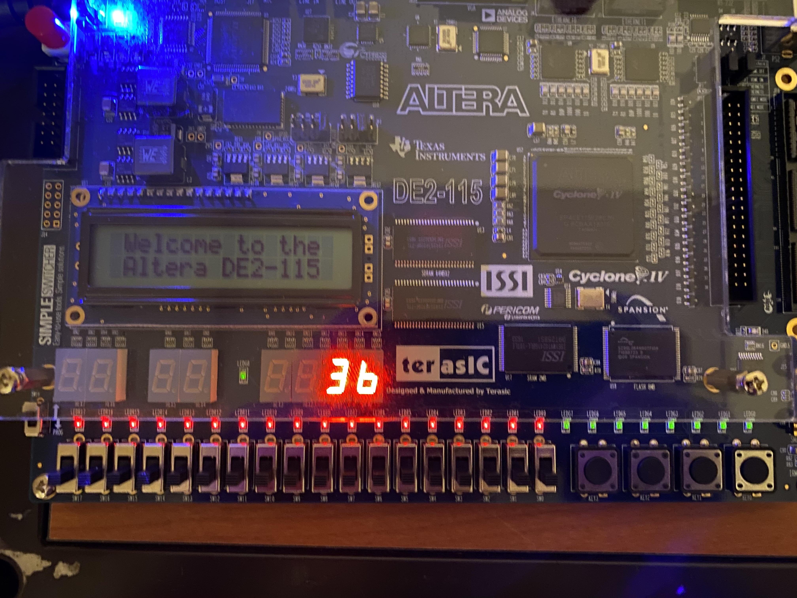
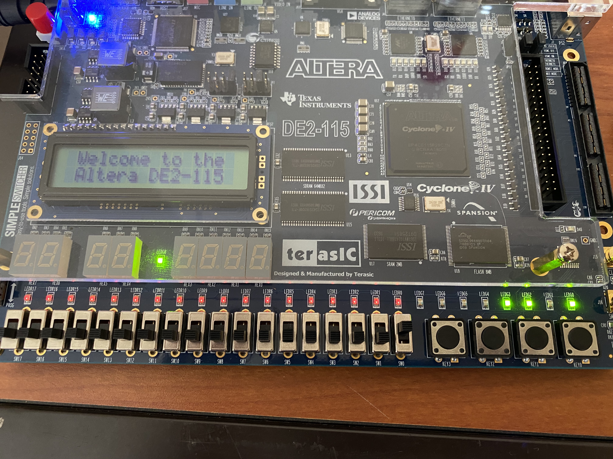

# ASIC FPGA Prototyping - Counter/Shift Register/State Machine Solution
## Overview
This document contians my (Jared's) solution to the counter, shift register, and state machine lab.

## "1101" Detector
My (Jared's) code can be found in the `counter-shift-register` folder on GitHub. 

The current state is shown on LEDG[2:0] in the bottom right. This picture is showing that we are currently in state 4, which corresponds to a "1101" event. Therefore, LEDG[8] is illuminated.

## Counters
My (Jared's) code can be found in the `counter-shift-register` folder on GitHub. 

### 4-bit counter on 7-segment display

#### Question: What is the difference in behavior between the `clear` button and the `n_rst` button? What happens when you press them?
The `n_rst` button immediately resets the system and sets the count back to zero. The `clear` button doesn't start the count over until a clock cycle occurs.

### 8-bit counter on 2 7-segment displays

#### Question: What do we have to divide our clock input by to get a 20 Hz clock?
50 MHz = 50,000,000 Hz. 50,000,000 Hz / 20 Hz = 2,500,000.

TODO: Insert picture of 16-bit auto_counter

#### Question: How can we divide our clock using the flex counter? How many bits wide does the counter need to be to get the clock to 20 Hz? What should the rollover value be set to? 
We can set the rollover value to the value we want to divide the clock by, then use the rollover flag as the clock signal. 2^22 = 4,194,304 Is the smallest power of two that can hold 2.5M. Therefore, we need a 22 bit wide counter to get the clock down to 20Hz. We'll set the rollover value to 2,500,000 and this will divide the 50 MHz clock down to 20Hz. 

## Serial-to-Parallel Shift Register
My (Jared's) code can be found in the `counter-shift-register` folder on GitHub.

### "1101" detector without state machines

In the bottom right you can see the output of the PtS Shift register. Since it is "1101" LEDG[8] is illuminated.